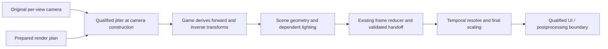

# Flat temporal AA through upstream camera construction

## Status

- State: proposed investigation and architecture, based on `418e5231`
  (`v0.18.0-rc.3`). No upstream flat camera hook, address, ABI or complete
  derivation chain has been identified or validated by this work.
- Decision: investigate jittering the game's per-view camera construction
  before it derives raster/lighting data. Preserve the existing frame
  discovery, size negotiation, temporal backends and resource isolation.
- Motivation: the build-verified 20260928_025912 user log reports zero renderer
  calls; three recurring unknown projection pairs keep every frame in
  observation. Sean reproduced non-activation with another ship; its exact
  shader correspondence remains unverified.
- Open hypotheses: a common producer covers the derived transforms; camera
  domains and recording epochs can be distinguished before mutation.
- Ruled out for that session: a backend evaluation failure as the immediate
  cause, because no backend initialized. Missing shader coverage is proven;
  whether quality settings or a mod produced those variants is not.
- Next: obtain the already-saved shaders/trace, map upload callers offline,
  then build one bounded passive probe covering the competing hypotheses. The
  next flight observes producers; it does not enable an unproven hook.
- Environment: Windows x64, D3D11 flat mono; headset/runtime N/A. VR
  comparison: EDVR's OpenVR/OpenXR route. Record GPU/driver, executable/build
  identities, backend versions, dimensions, formats and mod chain for
  qualification.
- This document extends the [flat AA
  design](design-flat-temporal-aa-2026-09-23.md) and [architecture
  review](review-flat-temporal-aa-2026-09-26.md). Its camera milestones below
  supplement, rather than renumber, their existing gates.

## 1. Problem and acceptance requirements

VR supplies Elite's eye projection through a runtime interface. EDVR applies
jitter there and Elite derives rendering data from that camera. See
`native_temporal.cpp`'s tangent-shift publication and
`openxr/openvr_system.cpp::GetProjectionMatrix/GetProjectionRaw`.

Flat's current adapter instead discovers a scene through D3D11 observations and
patches private constant buffers at draw/dispatch boundaries. It must recognize
each relevant projection consumer. At `418e5231`, unknown recipes call
`refuseDraw`; observation ends only after a completely covered frame. One
unfamiliar pair every frame therefore prevents all temporal treatment.

The user log shows 704/704 frames refused, `calls=0 init=0` and `partial=on
observing=1`. Retrieve its already-saved six stage bytecode files and
`flat_trace_13562.bin`, omitted by the support ZIP, before another flight.
Captures must not become a permanent requirement to authorize each ship.

The replacement must satisfy:

1. Support device/backend resolutions, including odd extents, crops and
   supersampling, using actual dimensions without hidden quality reduction.
2. Reconfigure and resume after supported quality/size changes without a
   restart. Indefinite warming is a failed qualification.
3. Support compatible EDHM/ReShade chains; name incompatible contracts.
4. Admit ships/materials through camera lineage, without per-ship allowlists.
5. Preserve disabled behavior and VR scheduling. Object-motion coverage is
   separate: camera-only motion may limit quality while valid AA continues.

This change does not automatically solve scene/depth discovery, DoF/HDR
handoffs, UI composition or moving-object motion. Those contracts remain.

## 2. Target boundary and ownership

Proposed flow; the upstream producer box is not yet located:

Prefer a per-view finalization boundary before projection-dependent matrices,
view rays and screen-to-world constants are derived. Change raster projection,
not world pose or simulation. Preserve the original camera and let the game
produce coherent derivatives from the modified input.

There must be one jitter owner for each scene phase group. A group contains all
passes sharing the scene's sampling grid/depth: it may include a main camera
plus cockpit or weapon cameras with different near planes. They must receive
compatible pixel offsets, not necessarily identical matrices.

Shadow, reflection, cube-map and UI cameras are not main-camera candidates
merely because their matrices or constant-buffer addresses look similar. Leave
independent domains unchanged. A secondary camera that contributes to the
shared scene must be explicitly related to its phase group or block that group.
Composite-only UI can remain outside it at a validated boundary.

Keep CPU visibility/culling stable and conservative over the jitter envelope.
If the candidate also builds culling data, prove how stable/conservative
culling coexists with jittered raster data; do not accept phase-dependent
visibility popping as AA. Preserve reversed-Z, depth range, FOV, asymmetric
frusta, viewport/crop and matrix storage conventions.

Unknown material hashes cease to be an admission barrier only for work whose
camera derivation is covered by this contract. A different shader hash is not
itself a violation; a new camera source or rewritten projection is.

## 3. Find the producer without assuming one exists

Existing anchors identify consumers, not a canonical constructor:

- `flat_temporal_model.h` observes scene b1[270..275]; `flat_runtime.cpp` and
  `vscreen.cpp` observe CPU writes before Unmap.
- `flat_camera_probe.h` samples an exact-pair conflict; `camera_view.h` reads
  external-camera mode. Neither provides an upstream projection API.
- Kinematic records are object poses. [Camera-row carry
  evidence](camera-rows-carry-2026-09-25.md) shows why latest/plausible rows
  cannot distinguish auxiliary views. The VR row layout is not a flat camera
  ABI.

Walk measured upload callers backward to their source objects and derivation
order. Compare these hypotheses in the same investigation:

| Candidate | Evidence required | Disqualifying result |
| --- | --- | --- |
| Per-view camera finalizer | Stable view identity; proposed mutation point precedes all relevant derived reads/writes | Some derivatives escape that point, or identity is ambiguous |
| Scene-constant packer | Proves every dependent product is built/rebuilt here | Merely copies already-derived matrices; other packs escape |
| Render-context/view-table builder | Joins camera domain and generation to subsequent scene traversal/uploads | It identifies only culling/auxiliary views or runs after consumers |

Record executable fingerprint, caller locations, source object/generation,
matrix values, destination range/write epoch, thread/context, view/pass and
downstream lineage. Frequency alone cannot select a producer. Do not invent
RVAs, calling conventions or a global camera pointer.

Before patching, validate the unique locator, instruction boundaries, ABI,
forwarding and lifetime against the executable and structural/callsite/store
checks. Unknown builds, ambiguous matches and conflicting patches disable the
integration. Reuse the existing hook mechanisms after this proof.

## 4. Passive evidence and bounded probes

First replay existing data and inspect exact bytecode. Then instrument all
plausible causes together. Sample still view, a deliberate pan, main/secondary
camera transitions and one scale change in a single prepared session.

Join producer entry/mutation/return, derived writes/uploads, bindings,
scene/depth writes and handoff by view, generation and execution order. Pointer
equality or Present alone is insufficient. Distinguish command-list recording
from replay, including repeated execution.

Initial capture limits: 240 metadata/small-matrix frames per segment, two
full-payload frames, four segments, 4,096 events/frame and 64 MiB total. These
are diagnostic budgets, not lifetime admission limits. Log caps, drops and
incomplete joins; overflow invalidates proof. Adjust from measured counts.

Discriminators: shared upstream sources support a common finalizer; derivatives
preceding the proposed mutation point refute that point; auxiliary views refute
a global-camera model; record/replay mismatches refute immediate-only lifetime.
Derivation inside the original constructor is valid when injection precedes it,
for example at its entry.

Emit armed/hook-hit/producer/join/overflow/completion counts, including zero.
Persist replayable evidence; include referenced trace/shaders and truncation
reasons in the support bundle. A silent hook is not a successful probe.

## 5. Proposed camera contract and early preparation

The existing `FlatFrameContract` is produced at output-copy time. It cannot
authorize an earlier camera mutation. Add a separate immutable early plan and
compare it with the completed frame contract; do not create a second scene
selector. The following are proposed records, not current APIs:

| Record | Required contents |
| --- | --- |
| Early render plan | Game/hook/device generations; view and phase-group identity; input/output resource generations and descriptors; R/E/D extents; crop/viewport mappings; backend/model; prepared-resource lease; expected derivation epoch |
| Camera application | Original camera snapshot; actual jitter in render pixels; derived-producer identities; view/recording/execution epochs; one-shot application result; reason on decline |
| Frame closure | Join to actual color/depth/handoff; all relevant camera derivations accounted for; actual sizes and phase; temporal accepted or recovery result; history commit/reset reason |

R is scene rendering, E backend evaluation, D display output. Convert jitter
using R and the viewport, never D/E. Preserve current negotiation: trained
backends normally use E=D for upscaling and E=R for supersampling, followed by
final scaling to D, subject to backend limits. Current TAA evaluates and stores
history at D; render-grid TAA is a separate deferred change. Include negotiated
E, formats, subresources and mappings in resource/history identity.

Bootstrap from zero-jitter observation and the reducer's scene/depth/handoff
selection, even while legacy shader coverage refuses. Upstream admission needs
separately counted producer/derivation proof; legacy refusal must not reset its
warm-up or history. Existing source selection also uses pool-family and
camera-row assumptions: extend it to proven producer/target association where
needed, never bypass scene selection wholesale.

On the render owner, prepare for the next eligible construction. Revalidate
identity, generations, sizes and readiness before mutation. A previous frame is
a prediction, not authority. Changed/unprepared plans remain stock.

Worker hooks must not call D3D, initialize backends or wait on GPUs. Publish
owned immutable records through a bounded thread-safe channel; overflow is a
named refusal. Never retain mapped/stack pointers. Preserve nested caller
attribution; quiesce in-flight users before reclamation without lock deadlock.

Apply jitter to an original/private camera copy with proven consumer lifetime.
Repeated construction uses the same phase without accumulating offsets.
Deferred consumers retain their generation through execution. Separate applied
phase from accepted history; failures cannot replay old evidence as fresh.

Publish both original and rendered camera records. Feed certified unjittered
rows to `FlatMonoResolveFrame.camera/previousCamera` and original scene
snapshots to engine motion's `sceneNow/scenePrev`, with actual raster jitter
carried separately. Upstream-modified uploads cannot silently become those raw
inputs. Prove provenance rather than guessing de-jitter transforms for unknown
layouts. Test normal, disabled, failed and history-reset paths for double
correction and preservation of raw motion inputs.

## 6. Transaction, transitions and recovery

Normal states are Observing -> Prepared -> Active. A violated contract moves to
Recovery and subsequent zero-jitter observation. Each state has a reason,
current generations and counters; stable supported scenes must progress.

Before first consumption, failure means no camera mutation. After camera data
is consumed, do not switch phase, turn on legacy per-draw patches or pretend
restoring a CPU matrix undoes drawn geometry.

At handoff compare resources, derivation identity, sizes and phase with the
plan. Only matching closure authorizes temporal history. Reject camera cuts,
missing/late writers, overrides and replay mismatches.

`flatMonoResolvePreflight` proves renderer/fallback resources and backend
availability, not size-specific vendor feature creation. Late backend failure
can use preallocated spatial recovery only for *proven coherent* jitter and
valid inputs, leaving history invalid. Unknown/mixed phase instead declines
EDVR replacement, invalidates history and stops subsequent jitter; acknowledge
the possible one-frame artifact. Device/allocation failure may prevent
recovery. No re-render or perfect rollback of mixed pixels is assumed.

Quality/ship/camera/size/fullscreen/device/backend/model changes invalidate
affected generations. Reprepare, reseed and release retired resources after
outstanding users finish. Prohibit ever-growing maps and steady allocations.
Exhaustion is a named unavailable state, not an endless per-draw retry.

## 7. Existing adapter and mod compatibility

Retain reducer, depth/color provenance, negotiation, motion, retirement and
state restoration. Version replay's new producer evidence; old traces cannot
certify an upstream hook they never recorded.

First run both observers without upstream writes. At activation select one
injector per group: legacy patches OR upstream construction. Suppress legacy
projection mutation under upstream ownership; retain observations and motion.
Switch only after outstanding work closes and history resets. Keep the legacy
route for environments it qualifies; never switch injectors mid-frame.

EDHM color/material variants consuming certified camera data should need no new
hashes. Camera/inverse/depth/composition changes require explicit contracts.
Detect post-construction writers by changed derivation/resource lineage.

For ReShade, verify loader/hook and AA/UI/effect order; preserve forwarding and
D3D state. Test each mod alone and together. Depth/projection replacement or
another temporal reconstruction may need integration or remain unsupported.

Keep user-facing AA settings unchanged. Report selected versus effective
treatment and a useful blocked reason instead of perpetual "warming". No
feature/config removal or rename is authorized by this design.

## 8. Delivery milestones and stop conditions

| Milestone | Required evidence before proceeding |
| --- | --- |
| C0: baseline | Reproduce logged classifier refusals; obtain saved bytes/trace; enumerate domains and candidate callers; no mutation |
| C1: producer discovery | Passive trace identifies domain/lifetime/ABI and proves ordering for all relevant derivatives; a counterexample rejects that boundary |
| C2: offline implementation proof | Pure event/reducer tests plus WARP geometry/lighting tests validate matrices, ownership, generations and recovery; existing suites remain green |
| C3: controlled activation | Full validation build; one bounded game session verifies actual producer -> derived data -> scene/depth -> accepted history with no duplicate jitter or uncovered domain |
| C4: qualification and promotion | Different ships/cameras, supported quality/size/backend changes and mod combinations work without new admission hashes; bounded resources and measured overhead; VR regression checks pass |

If no complete upstream boundary exists, publish the missing dependencies and
retain the existing adapter. A packer hook is acceptable only if it satisfies
the same complete-derivation proof, not as an undocumented partial substitute.

Desktop tests: forward/inverse/depth/ray consistency; raw motion preservation;
storage/reversed-Z/asymmetric projection; R/E/D routes and crops/odd sizes;
interleaved views; nested/worker calls; partial uploads; pointer reuse;
delayed/repeated replay; mid-job disable; late writers; duplicate jitter;
post-application backend failure; unrepairable mixed phase.

Live matrix: working/failing ships and distinct cockpits/canopies; on-foot/
weapon views; camera/menu/docking/flight transitions; presets/effects;
below/native/above-1.0 SS; resize and mod chains. Ship/camera-family diversity
is regression coverage, not a production allowlist or proof of arbitrary mods.

Counters: producer/derivation epochs, injector, applied jitter, closure,
treatment/history streaks and reset reasons. No persistent observation, mixed
phase, stale generation or hidden steady fallback. Compare CPU/GPU cost with
the existing adapter at the same scene/size. Steady state allocates nothing,
does no blocking readbacks/captures; resolve regressions before promotion.

Implementing C++ changes requires the full absolute-path `build.bat` and its
green receipt before commit. Install/verify/log operations use the sanctioned
tools. After promotion, retain an independent stand-down path for unknown
executables, conflicting hooks and unsupported camera domains.
